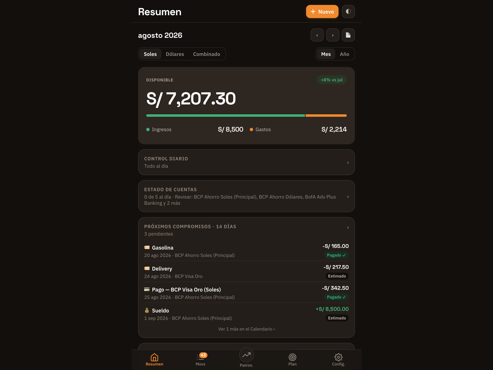
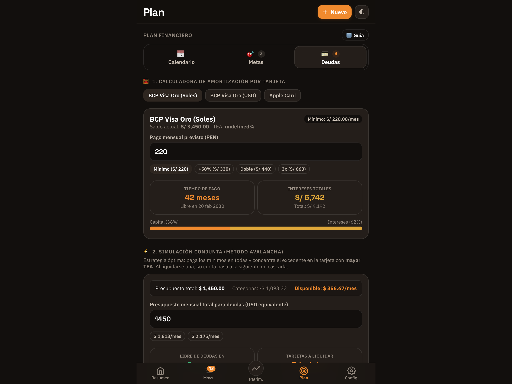
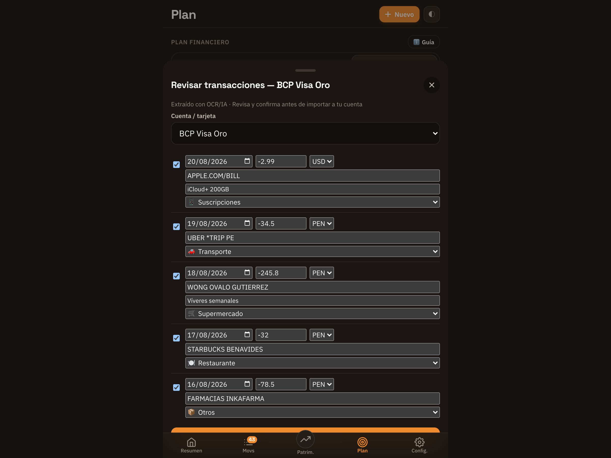
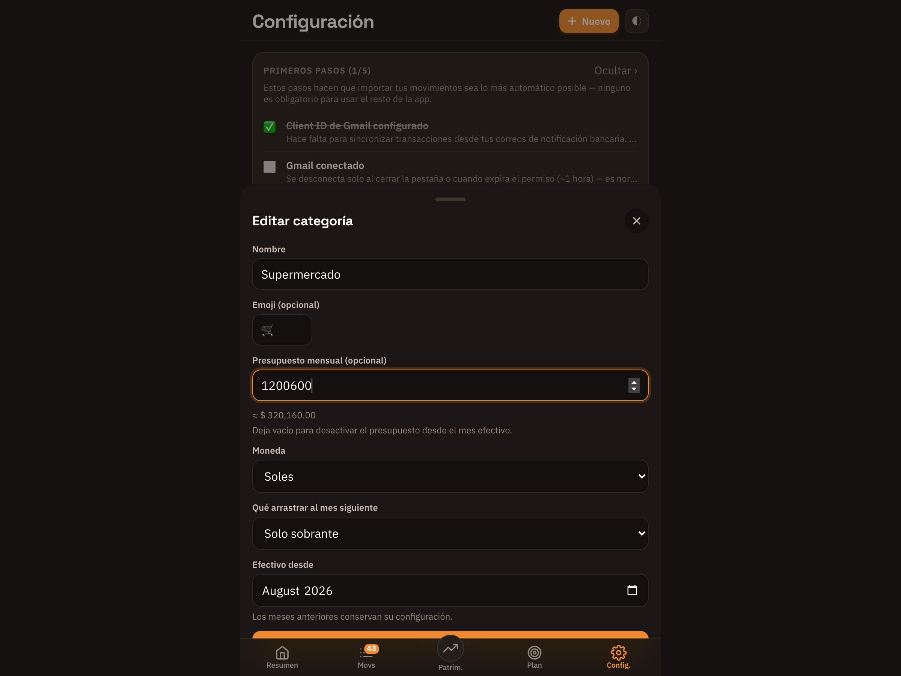
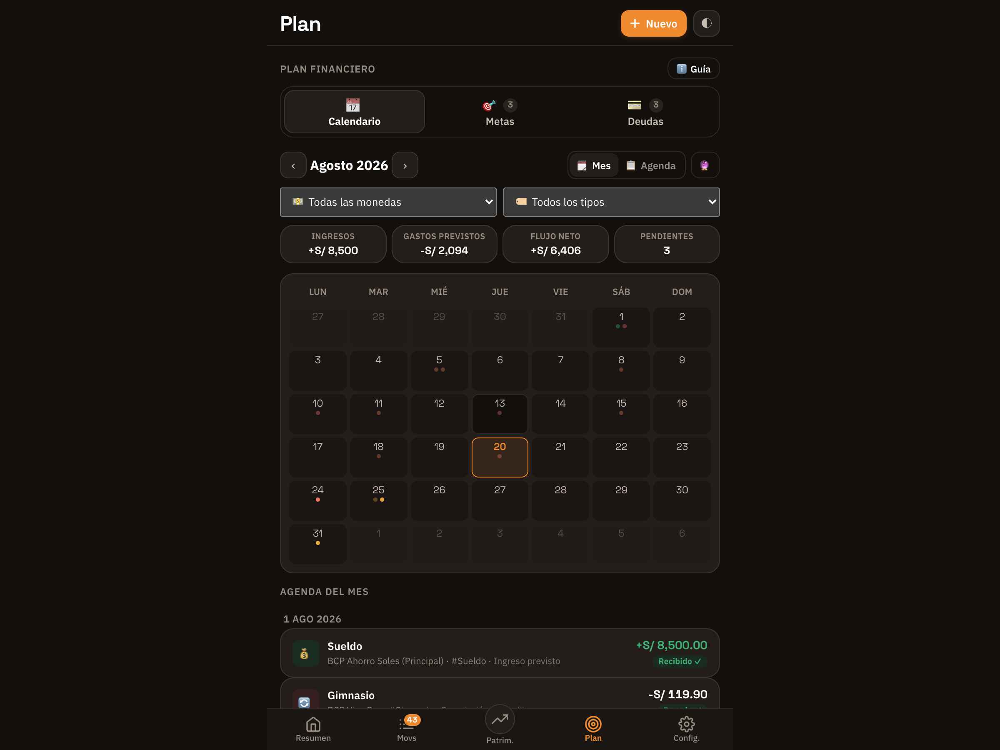
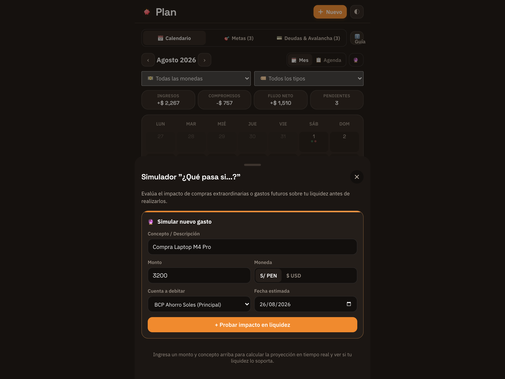
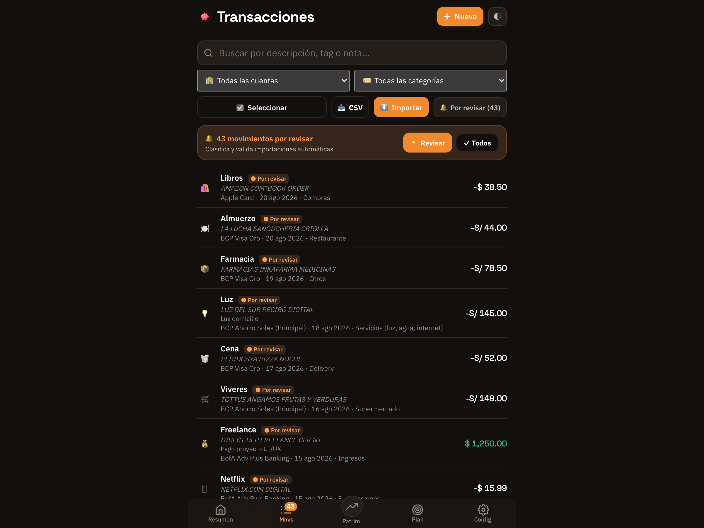
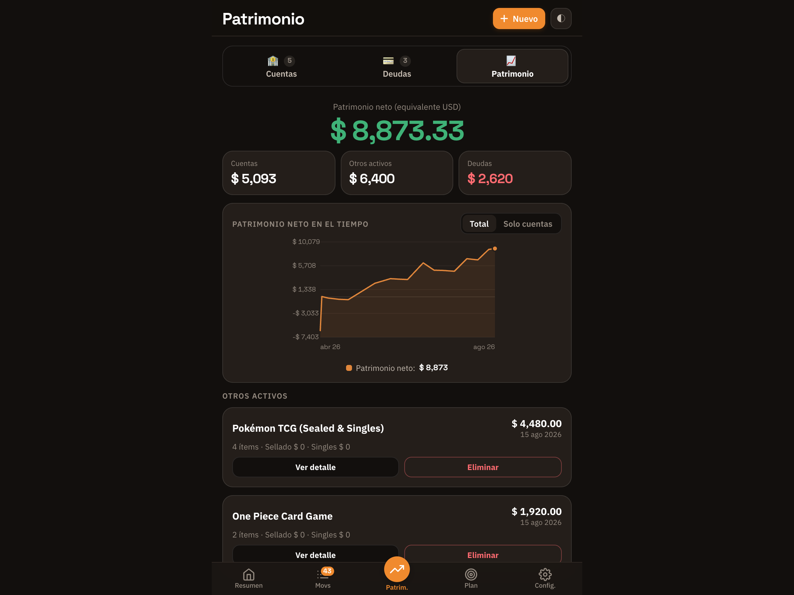
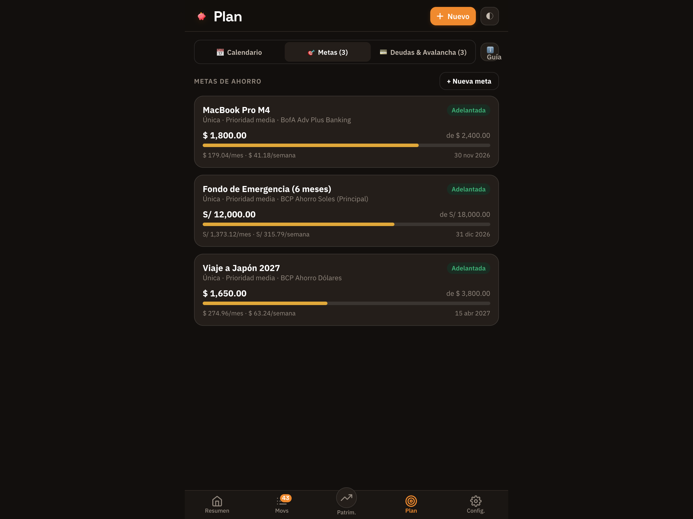
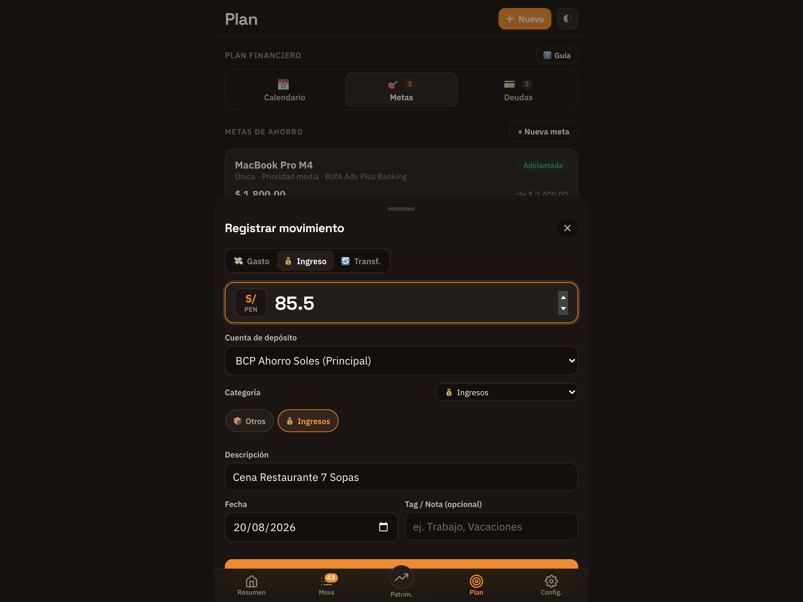

  

<h1 align="center">Chanchito</h1>

  <strong>App de finanzas personales local-first — sin backend, sin base de datos externa, con privacidad total y respaldos cifrados.</strong>

  
  
  
  
  
  

---

> **Nota sobre este repositorio**: Este repositorio es una vitrina técnica (*showcase*) del proyecto. El código fuente de desarrollo es privado al tratarse de una aplicación de uso personal que gestiona mis finanzas reales. Aquí se documentan las decisiones de arquitectura, diseño de sistemas y características técnicas implementadas.

---

## 📸 Capturas de Pantalla

_Todas las cifras de estas capturas son datos sintéticos generados para demostración — no representan información financiera real._

  
   
  <em><strong>1. Dashboard Principal</strong>: KPIs de flujo neto y disponible por moneda, widget de próximos compromisos a 14 días, gráfico de gastos históricos, donut interactivo por categoría y proyección de saldo a 45 días.</em>

  
   
  <em><strong>2. Plan de Deudas & Avalancha</strong>: Calculadora de amortización por tarjeta y simulador interactivo de cascada por TEA (Avalancha) con análisis de impacto de ahorro en presupuestos.</em>

  
   
  <em><strong>3. Revisión Editable de Importación (OCR / IA / Gmail / CSV)</strong>: Triage de movimientos importados con detección visual de cuenta, advertencias de duplicados y validación aritmética de balance antes de confirmar.</em>

  
   
  <em><strong>4. Presupuestos con Conversión de Moneda en Vivo</strong>: Configuración de límites por categoría con rollover automático y conversión de tipo de cambio en tiempo real (PEN ↔ USD).</em>

  
   
  <em><strong>5. Calendario Financiero Unificado & Agenda</strong>: Vista mensual y agenda a 45 días con conciliación automática de pagos recurrentes, cuotas y compromisos.</em>

  
   
  <em><strong>6. Simulador Predictivo "¿Qué pasa si...?"</strong>: Evaluación de impacto en flujo de caja ante gastos extraordinarios hipotéticos con diagnóstico de sobregiro y sugerencia de fecha segura.</em>

  
   
  <em><strong>7. Transacciones & Selección Múltiple</strong>: Búsqueda instantánea, filtros combinados, sugerencias por Machine Learning local (✨) y modo de edición/borrado masivo en lote.</em>

  
   
  <em><strong>8. Patrimonio Neto & Portafolio de Coleccionables</strong>: Consolidado en USD de cuentas, pasivos y activos coleccionables (cartas TCG) con carrusel visual de ítems de alto valor.</em>

  
   
  <em><strong>9. Metas de Ahorro & "Págate Primero"</strong>: Reservas de ahorro y fondos de emergencia con avance porcentual y cálculo automático de ritmo sugerido mensual.</em>

  
   
  <em><strong>10. Acceso Rápido Global (+)</strong>: Modal optimizado para captura instantánea de gastos, ingresos y transferencias en un solo toque.</em>

---

## 💡 El Problema

Los gestores de finanzas comerciales convencionales (Mint, YNAB, hojas de cálculo) presentan limitaciones estructurales para usuarios con necesidades particulares:
1. **Multi-moneda real y multi-país**: Manejo simultáneo de cuentas en Soles (PEN) y Dólares (USD) con tipos de cambio dinámicos y transacciones cruzadas.
2. **Deudas complejas y cálculo de intereses**: Simulación de amortización con TEA/APR real, pagos mínimos y optimización de pago en cascada.
3. **Patrimonio integral (activos no bancarios)**: Inclusión de colecciones de alto valor (cartas coleccionables TCG, inventarios) dentro del cálculo de patrimonio neto.
4. **Privacidad y soberanía de datos**: Garantía absoluta de que la información bancaria y financiera personal jamás resida en servidores de terceros.

---

## ✅ La Solución

**Chanchito** es una Progressive Web App (PWA) construida a medida con arquitectura *local-first*, que integra:
- **Control de Flujo de Caja y Presupuestos**: KPIs en tiempo real, desglose de gastos y asignación mensual con rollover.
- **Planificador Financiero Predictivo**: Calendario unificado de compromisos, conciliación automática contra movimientos reales y simulador interactivo *"¿Qué pasa si...?"* con diagnóstico de sobregiro.
- **Gestor de Deudas con Estrategia Avalancha**: Calculadora de amortización matemática verificada y simulador de cascada por costo financiero.
- **Patrimonio Neto Consolidado**: Cuentas bancarias + Activos/Coleccionables − Deudas en USD con historial evolutivo.
- **Pipeline de Importación Multimodal**: Extractos CSV/Excel bancarios, OCR/IA multimodal para capturas/PDFs y sincronización automática vía Gmail API.

---

## 🏗️ Decisiones de Arquitectura y Casos Reales

- **Local-first sin concesiones**: Cero frameworks, cero bundlers, cero build step. HTML/CSS/JS plano cargado directamente por el navegador. Todo el estado reside en `localStorage` (`finapp:v1`). Los datos financieros nunca abandonan el dispositivo.
- **Sistema de Parsers Declarativos (*Declarative-first*)**: Los extractos de bancos se procesan mediante esquemas JSON declarativos (`declarative-parser-schema.js`) ejecutados por un motor agnóstico (`declarative-parser-engine.js`), permitiendo añadir soporte a nuevos formatos o generar parsers asistidos por IA sin tocar código fuente.
- **Machine Learning Local en el Navegador**: Clasificador Naive Bayes local con tokenización bancaria, n-gramas y guardrails de seguridad (`category-classifier.js`) para sugerir categorías con alta precisión respetando siempre la precedencia de reglas declarativas del usuario.
- **IA como último recurso, no como default**: El pipeline de documentos prioriza parsers locales (PDFs nativos), luego OCR dedicado (Google Vision), y únicamente ante capturas complejas recurre a LLM (Claude Haiku) con confirmación explícita del usuario.
- **No pagar dos veces por el mismo documento & Forzado de IA**: Los resultados de extracción se almacenan en caché local indexados por hash SHA-256 del archivo y la cuenta elegida. Cuenta además con opción para forzar IA directa y un botón de invalidación/limpieza de caché granular para reanálisis inmediato.
- **Motor de Transferencias Internas y Enlace Bimoneda**: Algoritmo de detección voraz 1:1 (`transfer-pairing.js`) que auto-vincula transferencias entre cuentas propias en background, soporta flujos puente multi-moneda con comisiones (ej. Visa Oro PEN → PayPal → BofA USD) y ofrece un historial interactivo con desvinculación atómica en 1 clic.
- **Seguridad, Cifrado y Quirks de WebKit / iOS PWA**:
  - Bloqueo de app con PIN local de 6 dígitos mediante hash **PBKDF2-SHA256** con salt aleatorio de 100,000 iteraciones (`app-lock.js`).
  - **Zero Layout Shift en Lanzamiento Frío**: Diagnóstico y resolución de un quirk de WebKit en iOS donde `env(safe-area-inset-top)` resuelve a `0` en el primer layout pass de la PWA standalone antes de detectar el notch/Dynamic Island, solucionado mediante un clamp protector `max(83px, calc(var(--safe-top) + 24px))`.
  - **Teclado Circular Táctil**: Eventos optimizados vía `pointerdown` con respuesta háptica (`navigator.vibrate`) y guarda de 500ms contra eventos sintéticos fantasma.
  - Exportación de backups cifrados con **AES-GCM (256 bits)** protegidos por contraseña, con integración directa a **Google Drive**.
- **Diseño de Interfaz Móvil sin Truncamiento**: Subnavegación vertical tipo tarjetas/fichas en cuadrícula de 3 columnas que garantiza lectura completa y cero truncamiento tipográfico (`...`) en cualquier resolución de pantalla (desde iPhone SE hasta 16 Pro Max).
- **Motor de Gráficos Nativo**: Visualizaciones de línea, barra, donut y stacked trends renderizadas directamente en SVG/Canvas sin librerías externas pesadas.
- **Deep Linking y Atajos de iOS**: Soporte para parámetros URL en la PWA que habilitan captura instantánea de gastos en 1 segundo vía el Botón de Acción del iPhone o Siri Shortcuts.

---

## ✨ Módulos y Funcionalidades

### 1. Resumen (`Dashboard`)
- KPIs de flujo neto y presupuesto disponible por moneda (PEN / USD / Combinado).
- Widget de próximos compromisos a 14 días con resolución inteligente contra transacciones bancarias.
- Gráfico de gasto histórico de 6/12 meses, tendencias multi-mes apiladas y donut interactivo con filtrado contextual.
- Proyección de saldo a 45 días con alertas de umbral mínimo de seguridad.
- Filosofía **"Págate Primero"**: deducción opcional del ahorro mensual programado directamente del saldo disponible neto.

### 2. Transacciones (`Transactions`)
- Búsqueda instantánea multi-criterio y filtros unificados por cuenta, categoría y moneda.
- Modo de **Selección Múltiple y Edición Masiva** para recategorización, modificación de notas o borrado seguro en lote con barra de acciones inferior.
- Inbox de triage con badge en tiempo real (`🔔 N por revisar`) y detección inteligente de duplicados históricos con opción de descartar sospechas legítimas.
- Conciliación contable por cuenta/moneda y detección automática de transferencias internas vinculadas.

### 3. Patrimonio (`Accounts`)
- **Cuentas**: Saldos calculados, reconciliación con extractos bancarios y gráficos de balance histórico.
- **Deudas**: Monitoreo de líneas de crédito, cálculo de intereses reales (TEA/APR) y fechas de corte/pago.
- **Patrimonio Neto**: Consolidación total de activos líquidos, inventarios coleccionables y pasivos.
- **Coleccionables TCG en Alta Definición**: Portafolio de cartas con carrusel visual de ítems más valiosos, desglose por set y actualización automática a imágenes HD (1000x1000 px).

### 4. Plan (`Plan`)
- **Calendario Financiero Unificado**: Vista Grid mensual y Agenda con clasificación semántica y cromática (ingresos fijos, gastos fijos, habituales previstos, cuotas de deuda y metas).
- **Conciliación con Monto Real**: Adopción del valor bancario exacto cobrado conservando la referencia del estimado original.
- **KPIs Interactivos con Modales de Desglose**: Perforación directa desde las tarjetas de Ingresos, Gastos Previstos, Flujo Neto y Pendientes al listado cronológico de transacciones asociadas.
- **Simulador "¿Qué pasa si...?"**: Evaluación de impacto de gastos extraordinarios con detección preventiva de sobregiro y sugerencia de fecha segura.
- **Metas de Ahorro**: Asignación prioritaria sobre el disponible mensual y cálculo de ritmo sugerido de ahorro.
- **Simulador Avalancha**: Comparativa matemática de ahorro en intereses priorizando deudas por costo financiero.

### 5. Configuración e Importación (`Import & Settings`)
- **Importadores Multimodales**: CSV/Excel declarativo, capturas/PDFs vía OCR/IA con bypass de IA directa y sincronización con Gmail API vía OAuth2.
- **Auto-vinculación de Transferencias**: Configuración de enlace automático de transacciones y visor de historial con opción de desvincular en 1 tap.
- **Generador de Parsers con IA**: Creación guiada de esquemas de extracción a partir de archivos de muestra.
- **Gestión de Datos**: Calidad de datos, optimización de cuota de almacenamiento local y respaldos cifrados en Google Drive.

---

## 🛠️ Stack Tecnológico

| Capa | Tecnologías |
| :--- | :--- |
| **Frontend Core** | HTML5, CSS3 moderno (Custom Properties, Backdrop Filter, Safe Areas), JavaScript ES2022 Vanilla (sin frameworks ni bundlers) |
| **Persistencia Local** | `localStorage` API con verificación de cuota e integridad referencial |
| **Seguridad** | Web Crypto API (`PBKDF2`, `AES-GCM`, `SHA-256`), App Lock por inactividad y anti-destello |
| **Integraciones & Auth** | Google Identity Services (OAuth2 en cliente para Gmail y Drive), Cloudflare Workers (Proxy serverless efímero para IA) |
| **Procesamiento de Docs** | `pdf.js` (renderizado local), Google Vision OCR, Claude Haiku (Anthropic API con tool calling) |
| **Testing** | Node.js Test Suite nativa (11 suites automatizadas cubriendo cálculo financiero, parsers, ML y seguridad) |

---

## 👨‍💻 Rol y Desarrollo

Diseño y desarrollo end-to-end por **Álvaro Oliveros**:
- Definición de arquitectura *local-first* y diseño de experiencia de usuario (UI/UX) móvil y desktop.
- Implementación de los motores de cálculo financiero (amortización de deuda, proyección de flujo de caja, reconciliación contable y metas de ahorro).
- Construcción del motor de parsers declarativos y clasificador de machine learning local.
- Desarrollo de la suite completa de pruebas unitarias y de integración.

---

  <strong>¿Te interesa conocer más sobre la arquitectura o detalles técnicos?</strong> 
  Puedo facilitar acceso puntual al repositorio de desarrollo para procesos de entrevista técnica.

