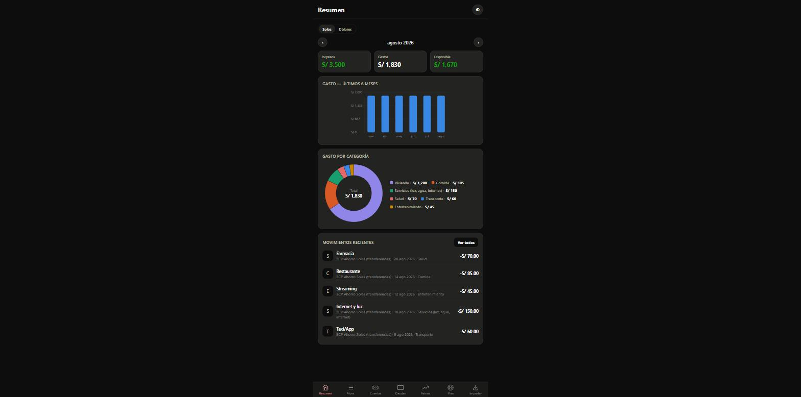
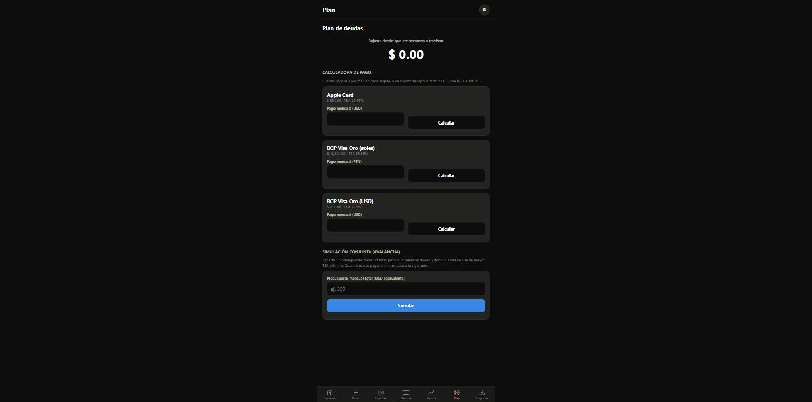
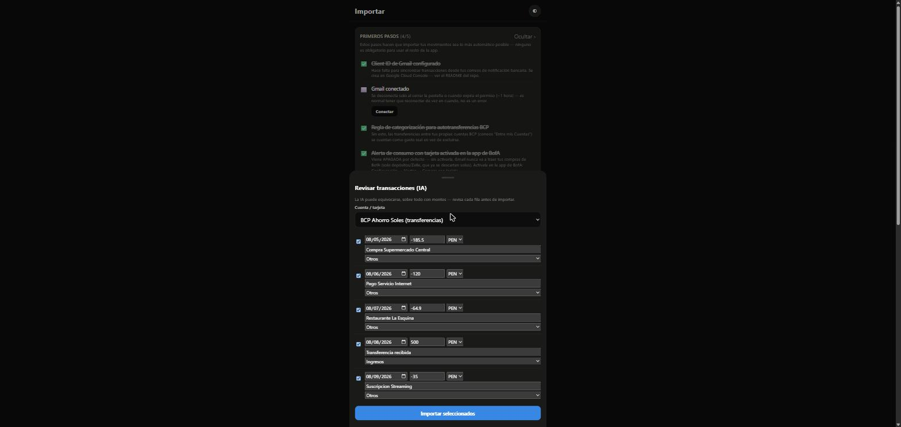

# Chanchito

**App de finanzas personales local-first — sin backend, sin base de datos externa, sin que tus datos financieros salgan nunca de tu navegador.**

     

> Este repositorio es una vitrina del proyecto. El código fuente es privado — es una app de uso personal que maneja mis finanzas reales, así que el repo de desarrollo no es público. Aquí documento las decisiones técnicas y lo que hace.

## 📸 Capturas

_Todas las cifras de estas capturas son datos de ejemplo generados para esta demo — no son mis finanzas reales._

_Resumen mensual, gasto por categoría, y proyección de saldo a 45 días._

_Calculadora de pago y simulador de estrategia "avalancha" por deuda._

_Toda importación (spreadsheet, IA, Gmail) pasa por esta pantalla editable antes de escribir a la base — ninguna automatización escribe directo._

## 💡 El problema

Los trackers de gastos genéricos (Mint, YNAB, hojas de cálculo) no cubren bien el caso de tener cuentas en dos monedas y países distintos, deudas con tasas de interés que hay que simular para decidir cómo pagarlas, y colecciones (cartas coleccionables) que también son parte del patrimonio real. Construí una app a medida para mi propio caso de uso, con control total sobre dónde viven mis datos.

## ✅ La solución

Una PWA instalable que cubre tracking de gastos, gestión de deudas con calculadora de pago y simulador de estrategia de pago (avalancha), y un dashboard de patrimonio neto que incluye tanto cuentas bancarias como colecciones como activos — todo en soles y dólares, con conversión automática solo donde tiene sentido (totales agregados, nunca en el registro individual).

## 🏗️ Decisiones de arquitectura

- **Local-first de verdad, no solo de palabra.** Sin framework, sin bundler, sin paso de build: HTML/CSS/JS planos cargados directamente. Todo el estado vive en una sola clave de `localStorage`. Esto no es una limitación técnica — es una decisión deliberada: mis datos financieros no tocan ningún servidor.
- **Una sola excepción a la regla, justificada:** el importador de movimientos por foto/PDF usa IA (Claude) para leer capturas de apps bancarias, lo cual requiere una API key. Como esa key no puede vivir en el cliente (sería visible en devtools), esa única funcionalidad pasa por un pequeño proxy serverless (Cloudflare Worker) que la mantiene del lado del servidor. Es la única pieza de "backend" en todo el proyecto, y solo toca las imágenes de forma efímera — nunca persiste nada.
- **Nunca confiar ciegamente en una extracción automática.** Tanto el importador de hojas de cálculo como el de IA muestran cada movimiento en una pantalla de revisión editable antes de guardar nada — incluyendo aviso de posibles duplicados. Ninguna automatización escribe directo a la base de datos.
- **PDFs procesados 100% en el navegador**, incluyendo PDFs con contraseña — la contraseña nunca sale del cliente. Cuando el PDF tiene una capa de texto real (típico en estados de cuenta generados por el banco), se lee directo en vez de renderizarlo a imagen — más barato y más confiable — con reconstrucción de la posición de cada valor hecha a mano, ya que el orden en que la librería de PDF entrega el texto no es el orden de lectura visual. Esto costó 3 intentos reales antes de dar con el enfoque correcto (agrupar por el borde derecho del último valor de cada fila, no por su borde izquierdo ni por el espacio libre desde el valor anterior — ambos fallan con montos alineados a la derecha), verificado contra un estado de cuenta real hasta que las 9 filas extraídas coincidieron exactas con el documento. Si el PDF no tiene texto útil (documento escaneado), cae automáticamente a renderizar imagen, sin que el usuario tenga que elegir.
- **Saber cuándo dejar de perseguir un problema con heurísticos.** Un tipo de estado de cuenta en particular imprime dos montos posibles por fila (uno por moneda) en columnas separadas, sin más indicación de cuál corresponde a cada fila que su posición horizontal — ambiguo incluso para una lectura humana rápida. Probé dos vías distintas para resolverlo (leer la página como imagen, y extraer su texto real reconstruyendo la posición de cada valor) con varias rondas de ajuste dentro de cada una, cada ronda medida contra un documento real, nunca contra una hipótesis. El resultado se estabilizó en una mejora parcial, no en una solución completa — la causa de fondo es que esa página en particular imprime varias tablas auxiliares sin relación con la de movimientos, lo que rompe cualquier heurístico simple de "columna más cercana a su encabezado". En vez de seguir ajustando indefinidamente, documenté el límite conocido y confié en que la pantalla de revisión obligatoria (ningún importador escribe directo a la base) ya acota el riesgo real a cero: hay problemas donde perseguir el 100% automático cuesta más de lo que vale frente a dejar que una persona confirme un caso ambiguo en segundos.
- **Reconstrucción histórica desde snapshots**: en vez de depender de que actualices manualmente cada saldo todos los meses, el sistema reconstruye el historial completo caminando hacia atrás desde el último snapshot manual a través de las transacciones ya importadas, y proyecta el saldo actual hacia adelante cuando hay transacciones más recientes que el último snapshot confirmado — con una regla deliberada de no sumar transacciones fechadas el mismo día que el snapshot (se asume que ya están reflejadas en ese número). Un caso real donde esa regla no alcanza por sí sola: dos saldos de deuda de la misma tarjeta, uno por moneda, habían quedado capturados con dos definiciones distintas de "saldo" (el monto ya facturado vs. el consumo real a la fecha) — invisible mirando cada uno por separado, pero se confirmó comparando cifra por cifra contra la app real del banco hasta que la diferencia exacta coincidió con un cargo puntual sin reflejar, y se corrigió el snapshot afectado en vez de asumir que la regla de proyección tenía un bug.
- **Motor de gráficos propio**, sin librería externa — línea, barra y donut hechos a mano, con eje de tiempo real (no por índice) para que el hover/tooltip sea preciso.
- **Detección de gastos recurrentes calibrada contra datos reales, no contra una hipótesis.** El motor agrupa transacciones por comercio (descripción normalizada, o un tag manual cuando el texto del banco es un código genérico sin nombre) y confirma un patrón cuando el monto se repite dentro de una tolerancia y la cadencia cae en un rango mensual. Corriéndolo contra el historial real destapó dos bugs reales antes de confiar en el resultado: la comparación de montos no distinguía signo (un gasto y un ingreso de magnitud parecida quedaban agrupados como si fueran el mismo movimiento) y un detector cruzado agrupaba transferencias P2P chicas a personas distintas por pura coincidencia de monto y fecha — resuelto con un piso de monto mínimo calibrado mirando la distribución real, no un número arbitrario. Un segundo caso reveló un límite del modelo original: un gasto genuinamente recurrente pero de monto variable (ej. sesiones de terapia, que varían según cuántas se pagaron ese mes) no calzaba con la regla de "monto parecido" pensada para suscripciones de costo fijo — se agregó una vía alternativa que confía en la repetición del tag manual en vez de en el monto cuando corresponde.
- **Proyección de flujo de caja a 45 días** combinando los patrones recurrentes detectados con los pagos de deuda programados, mostrando el primer día en que el saldo proyectado cruzaría por debajo de un umbral configurable. Para no depender solo de patrones ya confirmados por el historial, se puede registrar un gasto/ingreso recurrente esperado a mano (con una regla de texto opcional para autotagear transacciones futuras) — en cuanto hay suficientes datos reales tageados, el patrón detectado reemplaza al registro manual sin duplicarlo, verificado con una simulación de extremo a extremo antes de darlo por bueno.
- **Arreglar un bug destapó otro bug del mismo tipo, un paso más adelante.** La proyección de saldo de una cuenta que se repone con una transferencia recurrente (en vez de un ingreso normal) solo mostraba salidas, nunca la entrada que la financia — porque el motor de detección de patrones excluye transferencias en todos lados a propósito (no son "gasto" ni "ingreso" real para otras pantallas). Agregarlas de forma controlada para esta única pantalla destapó de inmediato un segundo problema: un pago de deuda real también es una transferencia, así que incluirlas sin filtrar duplicaba ese pago — una vez como evento programado, otra como patrón recién detectado en el historial real. Se resolvió quedándose solo con el lado entrante de una transferencia recurrente para la proyección; el saliente ya lo cubre el mecanismo de pagos de deuda, no hace falta modelarlo dos veces.
- **Backup cifrado opcional, no obligatorio — una decisión consciente sobre qué riesgo vale más la pena asumir.** El export de datos (para pasar información entre dispositivos) ahora se puede cifrar con una contraseña (PBKDF2 + AES-GCM, Web Crypto nativo) en vez de viajar en texto plano. Se decidió que fuera opcional en vez de forzarlo siempre: cifrar por defecto cambia un riesgo real pero acotado (el archivo cae en un canal que no controlas) por uno peor para un archivo de uso esporádico — olvidarte la contraseña y quedar sin forma de recuperar tus propios datos, porque el cifrado no tiene puerta trasera a propósito.
- **Un detector de "mismo comercio, tag distinto" necesitó dos señales, no una.** Agrupar transacciones por monto parecido + cadencia mensual sola generó, contra datos reales, 251 pares candidatos — la enorme mayoría sin relación real entre sí (una cadena de ~20 compras sueltas sin ningún parecido, unidas de a pares por un algoritmo union-find hasta formar un solo bloque). Se resolvió exigiendo dos condiciones a la vez, no una: exactamente un lado del par con una etiqueta puesta a mano (nunca comparar dos cosas ya identificadas independientemente entre sí — ahí vivía casi todo el ruido), y que cada lado se repita al menos dos veces por sí solo (un gasto realmente puntual no tiene patrón propio con el que comparar). Con ambas reglas juntas, los 251 candidatos bajaron a 1 — el único caso genuinamente ambiguo.
- **Autotagueo de suscripciones que comparten idéntico texto de banco, y un error propio corregido con datos reales.** Varias suscripciones (streaming, IA, música) llegan todas facturadas con el mismo texto genérico — el monto por sí solo casi alcanza para distinguirlas, salvo cuando dos cuestan casi lo mismo (12 centavos de diferencia entre dos de ellas confundió 3 cargos reales). El día de facturación resultó más confiable ahí — no varía mes a mes aunque el monto sí — pero usarlo como respaldo ciego generó un error real propio: un cargo de una suscripción sin ninguna relación con las demás quedó adjudicado "a la más parecida por monto" porque ningún día calzaba con nada. Corregido para que, cuando ningún candidato calza de verdad, la respuesta sea no adivinar — dejarlo sin tag en vez de forzar la mejor opción disponible.
- **Un KPI de "disponible" recalculado de cero tras confirmar que no reflejaba la realidad.** Restar los gastos del mes de los ingresos sonaba razonable, pero dejaba afuera algo real: el pago mensual de una tarjeta de crédito es plata que sí sale de la cuenta ese mes, y sin embargo no restaba nada (ya se había contado la compra original el mes que se hizo, así que sumarlo también hubiera contado el mismo gasto dos veces). La solución fue cambiar la pregunta que responde esa métrica: en vez de "ingresos menos gastos", ahora es el movimiento neto real de las cuentas bancarias (no las tarjetas) ese mes — una transferencia entre cuentas propias se cancela sola, pero un pago de tarjeta sí resta, porque esa plata no vuelve a entrar en ninguna cuenta que cuente.
- **Sacar el backup del navegador sin depender de un backend propio, de dos formas distintas.** En Chrome/Edge de escritorio, exportar deja elegir la carpeta real de destino (File System Access API) en vez de caer siempre en Descargas — sirve para guardar directo en una carpeta sincronizada (iCloud Drive, por ejemplo), sin necesitar ninguna API de Apple porque para el sistema operativo es solo una carpeta más. Para subir directo a Google Drive, reutilicé el mismo mecanismo de auth que ya tenía para leer Gmail (Google Identity Services), pero con su propio token y su propio permiso — angosto a propósito, solo ve archivos que la app misma crea — para no obligar a conceder los dos accesos juntos. Solo se ofrece para el backup cifrado, nunca en texto plano.
- **Reconocer que un modelo ya generalizaba, en vez de construir uno nuevo.** El patrimonio neto tenía una sección pensada para colecciones de cartas — al preguntarme qué más se podría trackear ahí (auto, propiedad, otra colección), la respuesta fue que el modelo (un snapshot manual de un solo número por activo) ya servía para cualquier cosa que no fuera cuenta bancaria ni deuda, sin código nuevo. Solo hizo falta renombrarla ("Otros activos"). El detalle ítem por ítem con fotos, en cambio, se mantuvo como la excepción — tiene sentido para una colección con muchas piezas de valor variable, no para un activo único como un auto.
- **Un fix "verificado" en una sola vista no está verificado — con varios toggles independientes, hay que barrer las combinaciones.** El dashboard tiene tres selectores independientes entre sí (moneda real, un modo "combinado" que junta ambas convertidas, y un rango mensual/anual) — 8 combinaciones posibles en total. Corregí una colisión de color real en el gráfico de categorías, la probé contra la vista anual, la di por resuelta — y volvió a fallar en un corte mensual en una sola moneda, porque qué categorías terminan compitiendo por un color cambia por completo según currency/período. La causa de fondo era estructural: con más categorías reales que colores disponibles, ninguna asignación fija por categoría puede ganar en las 8 vistas a la vez. La solución real fue dejar de asignar colores por categoría y asignarlos por posición dentro de cada gráfico puntual (nunca muestra más de las porciones que hay colores), y verificarlo con un script que recorre las 8 combinaciones y compara colores automáticamente — no una captura de pantalla a la vez.

## 🚀 Despliegue y seguridad

La app corre además como beta privada instalada en iOS ("Agregar a pantalla de inicio"), lo cual trajo decisiones que van más allá del código de la app en sí:

- **Deploy como sitio estático puro en Vercel**, sin build step ni framework — el mismo HTML/CSS/JS plano de siempre, servido tal cual. El proyecto convive en el mismo dominio raíz que otro producto propio en producción (un marketplace en Next.js), como proyecto de Vercel completamente separado con su propio subdominio, sin tocar el DNS, la configuración ni los registros de email de ese otro proyecto.
- **Gate de acceso vía Edge Middleware**, con un giro real de diagnóstico en vez de una decisión de manual: la primera versión usaba HTTP Basic Auth nativo. Probado en el dispositivo real, el diálogo nativo no se integraba con el Llavero/AutoFill de iOS dentro de una PWA instalada en modo standalone (límite conocido de WKWebView) — pedía login en cada apertura sin poder guardar la contraseña. Se reemplazó por una página de login propia servida desde el mismo middleware, con cookie de sesión firmada por HMAC-SHA256 (Web Crypto nativo, sin dependencias externas), que sí obtiene AutoFill en ambos modos.
- **CORS del proxy de IA restringido a un allowlist explícito** (antes abierto a cualquier origen) una vez que la app tuvo un dominio de producción real al que atarlo.
- Un bug de "por qué no toma la variable nueva" resultó ser que Vercel no reinyecta variables de entorno en un deployment que ya existe — cada uno queda con el snapshot de configuración de cuando se creó, así que hace falta un redeploy explícito. Encontrado comparando el estado real del dashboard contra el comportamiento esperado, no asumiendo la causa de entrada.

## ✨ Funcionalidades destacadas

- **Dashboard de resumen** con KPIs del mes, navegación mes a mes, y un donut de gastos por categoría completamente clickeable (perfora directo a la lista de transacciones ya filtrada).
- **Gestión de deudas**: saldo, TEA, pago mínimo y próxima fecha por cada deuda, con soporte para líneas de crédito compartidas entre monedas.
- **Calculadora de plan de pago**: dado un pago mensual, calcula meses hasta liquidar, interés total, y advierte si el pago propuesto ni siquiera cubre el interés (nunca se liquidaría).
- **Simulador de estrategia "avalancha"**: dado un presupuesto mensual total, ordena el pago óptimo entre todas las deudas priorizando la de mayor tasa. Los cálculos se verificaron a mano contra la fórmula cerrada de amortización de préstamos.
- **Patrimonio neto** que combina cuentas, deudas y "otros activos" (cualquier cosa que no sea cuenta bancaria ni deuda — colecciones, vehículos, propiedades) en un solo número, en el tiempo.
- **Colecciones con detalle ítem por ítem y foto**, no solo un número tipeado a mano — importa el CSV de colección de un marketplace de cartas coleccionables (parser propio, separado del pipeline de transacciones bancarias) y genera el snapshot de valor total solo, categorizando automáticamente producto sellado vs. cartas sueltas.
- **Tres métodos de importación**: archivos exportados por el banco (CSV/Excel), foto o PDF vía IA con detección automática de a qué cuenta corresponde, y sincronización directa desde el correo (Gmail API, autenticado 100% desde el navegador sin backend — un Client ID de OAuth no es secreto, así que ahí sí tiene sentido no usar proxy). Un bug real de este importador es buen ejemplo de por qué prefiero verificar contra datos reales antes de corregir algo a ciegas: un parser fallaba en silencio al extraer el destinatario de transferencias, y la hipótesis inicial (basada en un comentario en el propio código) resultó ser incorrecta — solo se confirmó la causa real, y se validó el fix, trayendo varios correos reales de prueba (sin importarlos) con una función de debug hecha para eso. Otro caso real ahí mismo: una transferencia entre dos cuentas propias solo actualizaba el saldo de origen, nunca el de destino, porque el banco solo manda un correo por transferencia (no uno por cada lado). Investigarlo destapó algo más de fondo — el banco puede tener dos cuentas reales con la misma etiqueta genérica, distinguibles solo por los últimos 4 dígitos, algo que el sistema no contemplaba — así que terminé rediseñando la resolución de cuenta para identificar por esos últimos 4 dígitos (aprendidos una sola vez, recordados después) en vez de por la etiqueta ambigua, y generando ambos lados de una transferencia interna en vez de uno solo.
- **Motor de reglas de categorización editable** desde la UI (antes vivía hardcodeado en el código).

## 🛠️ Stack técnico

**Cliente:** JavaScript vanilla (sin framework), HTML/CSS planos, `localStorage` como única base de datos, `pdf.js` para render de PDF en cliente.
**IA:** Claude (API de Anthropic) con tool-use forzado para extracción estructurada desde imágenes.
**Backend (mínimo, solo para la IA):** Cloudflare Worker como proxy que protege la API key.
**Auth de importación por correo:** Google Identity Services (OAuth) directo desde el navegador, sin backend.

## 👨‍💻 Mi rol

Diseño y desarrollo end-to-end en solitario: arquitectura local-first, los tres pipelines de importación (spreadsheet, IA multimodal, Gmail), motor de cálculo financiero (amortización, proyección de saldos), motor de gráficos propio, y el deploy/auth de producción (Vercel, Edge Middleware, DNS de subdominio sin afectar otro proyecto en el mismo dominio).

## 🛣️ Roadmap

Confirmar el formato real de las alertas de compra de BofA para el importador de Gmail — la alerta ya está activada del lado del banco, en espera del primer correo real de ejemplo antes de implementar el parser (deliberado: no adivinar el formato) — y ampliar cobertura de bancos soportados en los importadores automáticos.

---

**¿Quieres ver el código o el detalle técnico completo?** Puedo dar acceso puntual al repositorio privado para procesos de entrevista.
